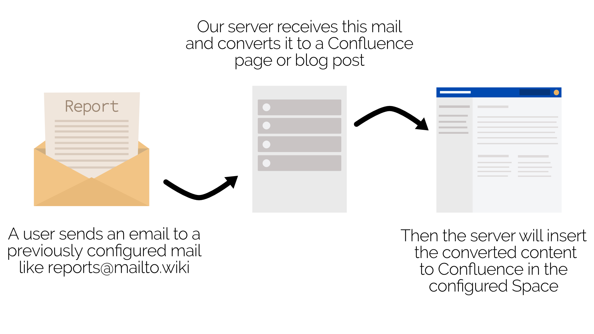

# mailto.wiki – Send-Emails-to-Confluence

This add-on converts emails to Confluence pages or blog posts. It helps you to store and reference recurring newsletters, meeting notes and documentation in Confluence Cloud.

## Getting started

[Go to the User Documentation](https://github.com/craft-coders/mailto.wiki-Send-Emails-to-Confluence/wiki)

## Issue Tracking

[Here on Github](https://github.com/craft-coders/mailto.wiki-Send-Emails-to-Confluence/issues)
